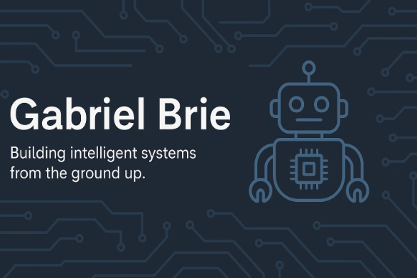

  

  
  
  
  # 👋 Hi, I'm Gabriel Brie
  ### ⚡ G B – Applied Electronics Enthusiast

---

🎓 First-year student in **Applied Electronics**, passionate about merging code with circuits to build smart, autonomous systems.  
Currently diving into robotics, microcontrollers, and learning by creating.

---

## 🛠️ Tech Stack

---

## 🚀 What I'm Learning

- 🧠 Building autonomous robots (robotics course)
- 🧰 Embedded systems with Arduino & C/C++
- 🌐 Front-end basics with HTML/CSS/JS
- ⚡ Circuit design in Target3001 & EasyEDA

---

## 💡 Motto

> _"Turning wires and code into innovation."_  

---

## 🤝 Open for Collaboration

- 🔍 Always curious to learn more
- 💼 Open to internships, collabs or side-projects
- 📬 Let’s build something together!

---

## 📫 Connect with Me

- **LinkedIn:** Coming Soon!
- **GitHub:** [https://github.com/GabrielBrie](https://github.com/GabrielBrie)
- **Email:** brie.gabriel@icloud.com

---

## 📈 GitHub Stats

---

  
  _Let’s build the future, one wire at a time._ 🔌

